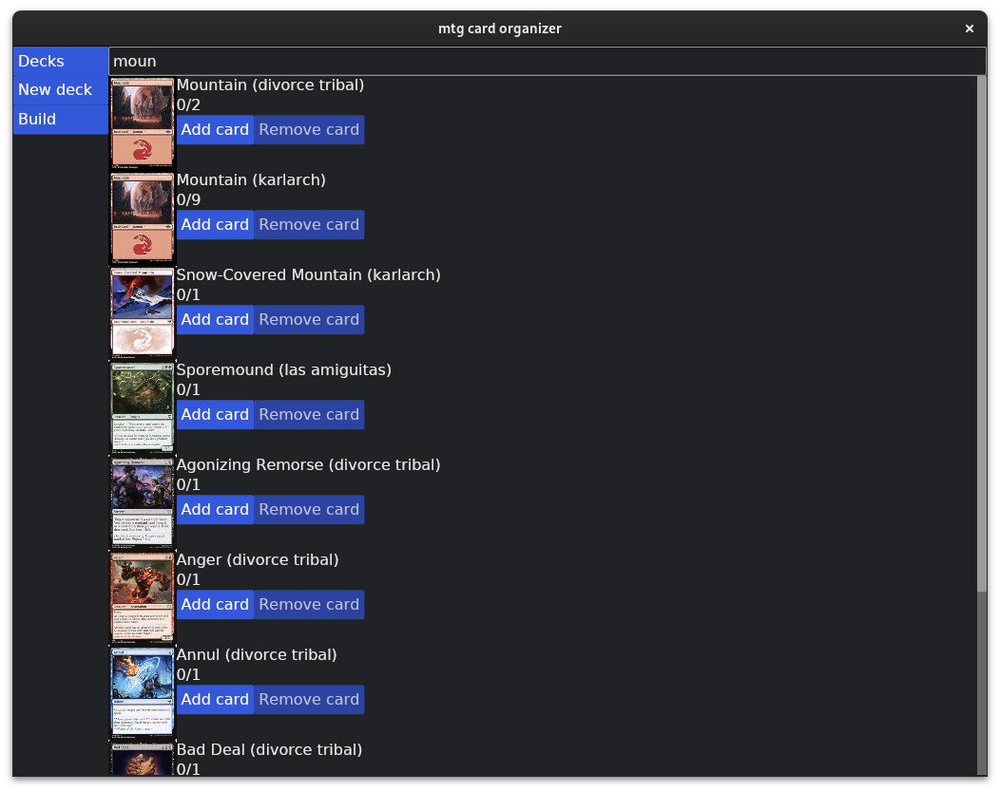

# mtg-card-organizer

Utility to help organize cards into decks.

You can create decks. Cards are parsed against scryfall. Then you can fuzzy-search any card and add them to any of the decks.

The UI is barely functioning, but it works for its purpose.

## Use

### Windows

Should work out of the box.

### Linux

Needs `zenity` or `kdialog` for the import/export dialogs to work.

### MacOS

Theoretically should work out of the box but not tested.

